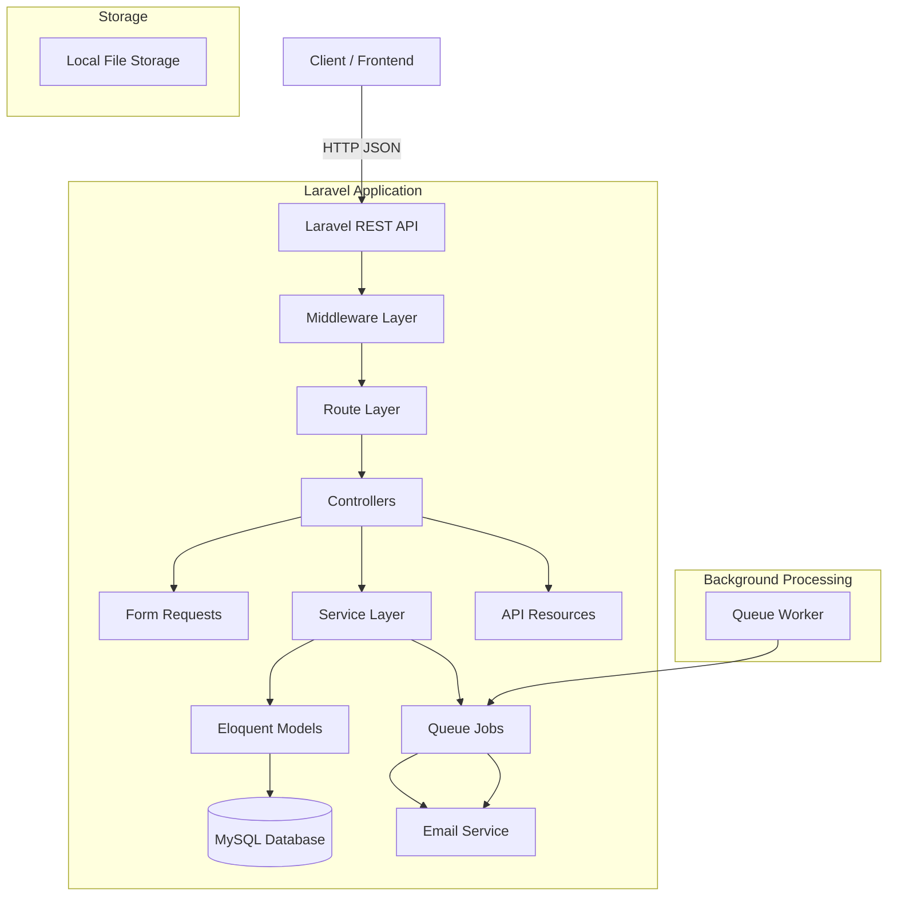
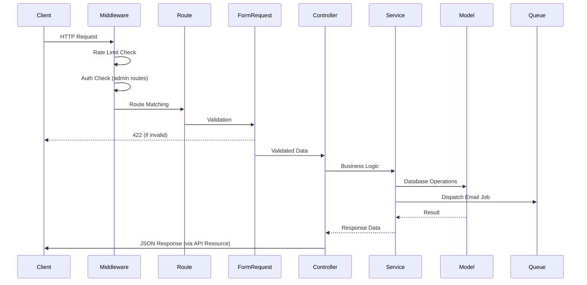
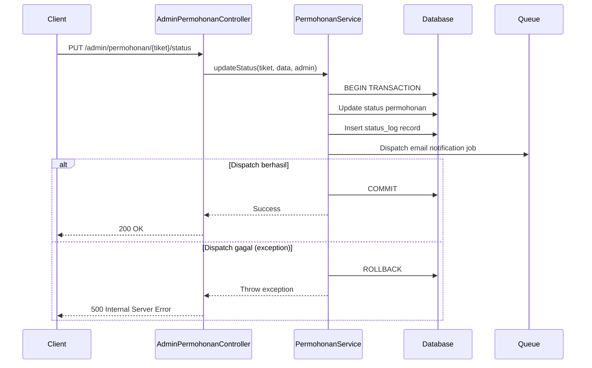
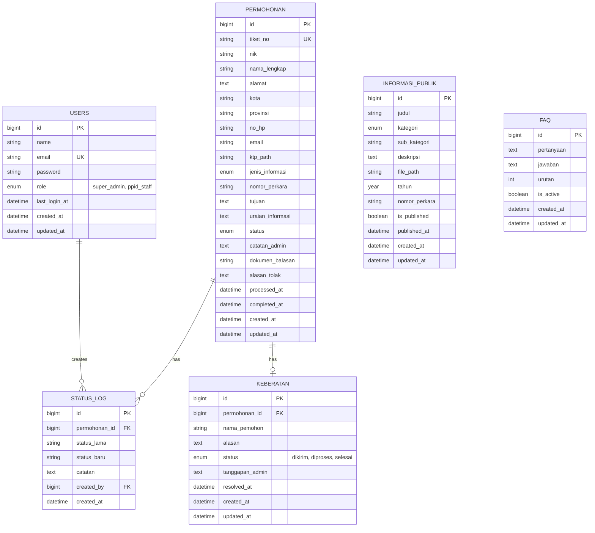

# Design Document: Portal PPID Backend

## Overview

Portal PPID Backend adalah REST API untuk Portal PPID (Pejabat Pengelola Informasi dan Dokumentasi) Pengadilan Agama Penajam. Sistem ini menyediakan layanan permohonan informasi publik, pelacakan status, pengajuan keberatan, manajemen informasi publik, FAQ, dashboard admin, autentikasi, notifikasi email async, dan file upload.

### Tujuan Teknis
- Menyediakan REST API backend-only (JSON response) untuk Portal PPID
- Mengimplementasikan autentikasi admin via Laravel Sanctum token-based
- Memproses notifikasi email secara async melalui Laravel Queue (database driver)
- Menerapkan rate limiting untuk proteksi endpoint publik
- Menggunakan timezone Asia/Makassar (WITA) untuk semua timestamp

### Tech Stack
- **Runtime**: PHP 8.4
- **Framework**: Laravel 13
- **Database**: MySQL
- **Authentication**: Laravel Sanctum (token-based)
- **Queue**: Laravel Queue (database driver)
- **Testing**: Pest 4
- **Export**: PhpSpreadsheet (untuk export Excel)

### Design Decisions
1. **Backend-only tanpa Inertia**: Semua endpoint mengembalikan JSON, tidak ada view rendering
2. **API versioning via URL prefix**: `/api/v1/` untuk mendukung evolusi API di masa depan
3. **Form Request classes terpisah**: Setiap endpoint memiliki Form Request sendiri untuk validasi
4. **Eloquent API Resources**: Response formatting konsisten menggunakan API Resources
5. **Queue-based email**: Notifikasi email diproses async agar tidak memblokir response API
6. **Tiket number generation**: Format PPID-YYYYMMDD-XXXX dengan auto-increment harian menggunakan database locking untuk thread safety

## Architecture

### High-Level Architecture



### Request Flow



### Request Flow: Status Update dengan Email Dispatch (Req 12.7)

Untuk endpoint update status permohonan, status change dan email dispatch dibungkus dalam `DB::transaction` agar rollback otomatis jika dispatch gagal:



### Layer Responsibilities

| Layer | Tanggung Jawab |
|-------|---------------|
| **Middleware** | Rate limiting, authentication, CORS, logging |
| **Form Request** | Input validation, authorization |
| **Controller** | Request handling, response formatting |
| **Service** | Business logic, orchestration |
| **Model** | Data access, relationships, scopes |
| **Job** | Async operations (email notifications) |
| **API Resource** | Response transformation & formatting |

## Components and Interfaces

### Controllers

| Controller | Prefix | Auth | Deskripsi |
|-----------|--------|------|-----------|
| `AuthController` | `/api/v1/auth` | Partial | Login/logout admin |
| `PermohonanController` | `/api/v1/permohonan` | No | Submit & cek status permohonan |
| `KeberatanController` | `/api/v1/keberatan` | No | Submit keberatan |
| `InformasiPublikController` | `/api/v1/informasi-publik` | No | List & download informasi publik |
| `FaqController` | `/api/v1/faq` | No | List FAQ publik |
| `AdminPermohonanController` | `/api/v1/admin/permohonan` | Yes | CRUD permohonan (admin) |
| `AdminKeberatanController` | `/api/v1/admin/keberatan` | Yes | Manage keberatan (admin) |
| `AdminInformasiPublikController` | `/api/v1/admin/informasi-publik` | Yes | CRUD informasi publik (admin) |
| `AdminFaqController` | `/api/v1/admin/faq` | Yes | CRUD FAQ (admin) |
| `AdminLaporanController` | `/api/v1/admin/laporan` | Yes | Export laporan Excel |
| `AdminStatistikController` | `/api/v1/admin/statistik` | Yes | Dashboard statistik |

### Service Classes

| Service | Tanggung Jawab |
|---------|---------------|
| `PermohonanService` | Buat permohonan, generate tiket, update status dengan transactional email dispatch, transisi validasi via `validatePermohonanTransition()` |
| `KeberatanService` | Buat keberatan, validasi eligibility, update status/tanggapan via `validateKeberatanTransition()`, support update tanggapan_admin tanpa perubahan status |
| `TiketGeneratorService` | Generate nomor tiket unik harian (PPID-YYYYMMDD-XXXX) |
| `FileUploadService` | Handle upload file (KTP, dokumen, informasi publik) dengan validasi ukuran min 1KB (dokumen PDF) dan max sesuai tipe |
| `LaporanService` | Generate export Excel |
| `StatistikService` | Hitung statistik dashboard |

### Form Request Classes

| Form Request | Endpoint |
|-------------|----------|
| `LoginRequest` | POST /auth/login |
| `StorePermohonanRequest` | POST /permohonan |
| `StoreKeberatanRequest` | POST /keberatan |
| `UpdateStatusPermohonanRequest` | PUT /admin/permohonan/{tiket_no}/status |
| `UploadDokumenBalasanRequest` | POST /admin/permohonan/{tiket_no}/dokumen |
| `UpdateKeberatanRequest` | PUT /admin/keberatan/{id} |
| `StoreInformasiPublikRequest` | POST /admin/informasi-publik |
| `UpdateInformasiPublikRequest` | PUT /admin/informasi-publik/{id} |
| `StoreFaqRequest` | POST /admin/faq |
| `UpdateFaqRequest` | PUT /admin/faq/{id} |
| `ExportLaporanRequest` | GET /admin/laporan/permohonan |

**`UpdateKeberatanRequest` validation rules:**
- `status`: optional, nullable, in:dikirim,diproses,selesai
- `tanggapan_admin`: required_if status = selesai, nullable string min 10 karakter

**`UploadDokumenBalasanRequest` validation rules:**
- `file`: required, mimes:pdf, min:1 (KB), max:10239 (< 10MB, file tepat 10MB ditolak)

### Queue Jobs

| Job | Trigger | Deskripsi |
|-----|---------|-----------|
| `SendPermohonanCreatedNotification` | Permohonan baru dibuat | Kirim email konfirmasi + tiket ke pemohon |
| `SendStatusChangedNotification` | Status permohonan berubah | Kirim email status baru ke pemohon |
| `SendKeberatanNotification` | Keberatan baru dibuat | Kirim email notifikasi ke admin |

### API Resources

| Resource | Model | Penggunaan |
|----------|-------|------------|
| `PermohonanResource` | Permohonan | Response detail permohonan (publik) |
| `PermohonanAdminResource` | Permohonan | Response detail permohonan (admin, lengkap) |
| `PermohonanCollection` | Permohonan | Response list permohonan |
| `KeberatanResource` | Keberatan | Response detail keberatan |
| `InformasiPublikResource` | InformasiPublik | Response info publik |
| `FaqResource` | Faq | Response FAQ |
| `StatusLogResource` | StatusLog | Response riwayat status |
| `StatistikResource` | - | Response statistik dashboard |

### Middleware

| Middleware | Scope | Deskripsi |
|-----------|-------|-----------|
| `sanctum:auth` | Admin routes | Token authentication via Sanctum |
| `throttle:api` | All API | Global rate limit 60/menit |
| `throttle:permohonan` | POST permohonan | Rate limit 3/jam per IP |
| `LogAdminAction` | Admin routes | Log aksi admin ke Laravel log |

### Component Detail: PermohonanService

```php
class PermohonanService
{
    /**
     * Update status permohonan dengan transactional email dispatch.
     * Jika dispatch email gagal, seluruh perubahan status di-rollback.
     * 
     * @throws \RuntimeException jika dispatch email gagal
     */
    public function updateStatus(Permohonan $permohonan, string $statusBaru, array $data, User $admin): Permohonan
    {
        // Validasi transisi menggunakan method khusus permohonan
        $this->validatePermohonanTransition($permohonan->status, $statusBaru);
        
        return DB::transaction(function () use ($permohonan, $statusBaru, $data, $admin) {
            $statusLama = $permohonan->status;
            
            // Update status dan field terkait
            $permohonan->update([
                'status' => $statusBaru,
                'catatan_admin' => $data['catatan_admin'] ?? $permohonan->catatan_admin,
                'alasan_tolak' => $data['alasan_tolak'] ?? $permohonan->alasan_tolak,
                'processed_at' => $statusBaru === 'diproses' ? now('Asia/Makassar') : $permohonan->processed_at,
                'completed_at' => in_array($statusBaru, ['selesai', 'ditolak']) ? now('Asia/Makassar') : $permohonan->completed_at,
            ]);
            
            // Buat status_log
            $permohonan->statusLogs()->create([
                'status_lama' => $statusLama,
                'status_baru' => $statusBaru,
                'catatan' => $data['catatan_admin'] ?? null,
                'created_by' => $admin->id,
            ]);
            
            // Dispatch email — jika gagal, transaction rollback
            SendStatusChangedNotification::dispatch($permohonan);
            
            return $permohonan->fresh();
        });
    }

    /**
     * Validasi transisi status permohonan.
     * Rules: baru→diproses, diproses→selesai, diproses→ditolak, self-transition semua status.
     */
    public function validatePermohonanTransition(string $statusSaatIni, string $statusBaru): void
    {
        // Self-transition diizinkan untuk semua status
        if ($statusSaatIni === $statusBaru) {
            return;
        }
        
        $allowedTransitions = [
            'baru' => ['diproses'],
            'diproses' => ['selesai', 'ditolak'],
            'selesai' => [],
            'ditolak' => [],
        ];
        
        if (!in_array($statusBaru, $allowedTransitions[$statusSaatIni] ?? [])) {
            throw new InvalidStatusTransitionException('Transisi status tidak valid');
        }
    }
}
```

### Component Detail: KeberatanService

```php
class KeberatanService
{
    /**
     * Update keberatan — mendukung dua mode:
     * 1. Update status (dengan validasi transisi ketat)
     * 2. Update tanggapan_admin saja (tanpa perubahan status)
     */
    public function update(Keberatan $keberatan, array $data): Keberatan
    {
        // Jika status disertakan DAN berbeda dari status saat ini → validasi transisi
        if (isset($data['status']) && $data['status'] !== $keberatan->status) {
            $this->validateKeberatanTransition($keberatan->status, $data['status']);
            
            $keberatan->update([
                'status' => $data['status'],
                'tanggapan_admin' => $data['tanggapan_admin'] ?? $keberatan->tanggapan_admin,
                'resolved_at' => $data['status'] === 'selesai' ? now('Asia/Makassar') : $keberatan->resolved_at,
            ]);
        } elseif (isset($data['status']) && $data['status'] === $keberatan->status) {
            // Self-transition DITOLAK untuk keberatan
            throw new InvalidStatusTransitionException('Transisi status tidak valid');
        } else {
            // Update non-status field saja (tanggapan_admin)
            $keberatan->update([
                'tanggapan_admin' => $data['tanggapan_admin'] ?? $keberatan->tanggapan_admin,
            ]);
        }
        
        return $keberatan->fresh();
    }

    /**
     * Validasi transisi status keberatan.
     * Rules: dikirim→diproses, diproses→selesai. Self-transition DITOLAK.
     * BERBEDA dari permohonan: self-transition tidak diizinkan.
     */
    public function validateKeberatanTransition(string $statusSaatIni, string $statusBaru): void
    {
        // Self-transition ditolak (berbeda dari PermohonanService)
        if ($statusSaatIni === $statusBaru) {
            throw new InvalidStatusTransitionException('Transisi status tidak valid');
        }
        
        $allowedTransitions = [
            'dikirim' => ['diproses'],
            'diproses' => ['selesai'],
            'selesai' => [],
        ];
        
        if (!in_array($statusBaru, $allowedTransitions[$statusSaatIni] ?? [])) {
            throw new InvalidStatusTransitionException('Transisi status tidak valid');
        }
    }
}
```

**Perbedaan kunci validasi transisi:**
| Aspek | `PermohonanService` | `KeberatanService` |
|-------|--------------------|--------------------|
| Self-transition | ✅ Diizinkan semua status | ❌ Ditolak |
| Method | `validatePermohonanTransition()` | `validateKeberatanTransition()` |
| Update non-status | Tidak ada (selalu via status endpoint) | ✅ `tanggapan_admin` bisa di-update tanpa status |

### Component Detail: AdminKeberatanController

```php
class AdminKeberatanController extends Controller
{
    /**
     * PUT /api/v1/admin/keberatan/{id}
     * 
     * Mendukung dua mode operasi:
     * 1. Update status + tanggapan → field `status` disertakan dalam request body
     * 2. Update tanggapan_admin saja → field `status` TIDAK disertakan dalam request body
     * 
     * UpdateKeberatanRequest memvalidasi:
     * - `status` bersifat optional (nullable), jika ada harus salah satu enum valid
     * - `tanggapan_admin` wajib jika status berubah ke selesai, optional jika hanya update tanggapan
     */
    public function update(UpdateKeberatanRequest $request, Keberatan $keberatan): JsonResponse
    {
        $keberatan = $this->keberatanService->update($keberatan, $request->validated());
        
        return response()->json([
            'status' => 'success',
            'data' => new KeberatanResource($keberatan),
        ]);
    }
}
```

### Component Detail: FileUploadService

```php
class FileUploadService
{
    /**
     * Validasi dan upload file dokumen balasan.
     * Requirement 13: ukuran minimal 1KB, maksimal < 10MB, format PDF only.
     */
    public function uploadDokumenBalasan(UploadedFile $file): string
    {
        $this->validateDokumenBalasan($file);
        
        return $file->store('uploads/dokumen');
    }

    private function validateDokumenBalasan(UploadedFile $file): void
    {
        // Validasi minimum 1KB (Req 13.4)
        if ($file->getSize() < 1024) {
            throw ValidationException::withMessages([
                'file' => ['File terlalu kecil, minimal 1KB'],
            ]);
        }
        
        // Validasi maksimal < 10MB (Req 13.5) — file tepat 10MB ditolak
        if ($file->getSize() >= 10 * 1024 * 1024) {
            throw ValidationException::withMessages([
                'file' => ['Ukuran file maksimal 10MB'],
            ]);
        }
    }
}
```

### Component Detail: AuthController Error Handling

```php
class AuthController extends Controller
{
    /**
     * POST /api/v1/auth/login
     * 
     * Error handling:
     * - 401: Credential definitif salah (email/password tidak match)
     * - 500: Internal error selama proses validasi credential (DB error, exception unexpected)
     */
    public function login(LoginRequest $request): JsonResponse
    {
        try {
            if (!Auth::attempt($request->validated())) {
                return response()->json([
                    'status' => 'error',
                    'message' => 'Email atau password salah',
                ], 401);
            }
            
            $user = Auth::user();
            $user->update(['last_login_at' => now('Asia/Makassar')]);
            $token = $user->createToken('auth-token')->plainTextToken;
            
            return response()->json([
                'status' => 'success',
                'data' => [
                    'token' => $token,
                    'user' => new UserResource($user),
                ],
            ]);
        } catch (\Throwable $e) {
            // Internal error selama validasi credential (Req 2.2)
            Log::error('Login internal error', [
                'email' => $request->email,
                'error' => $e->getMessage(),
            ]);
            
            return response()->json([
                'status' => 'error',
                'message' => 'Terjadi kesalahan internal saat memproses login',
            ], 500);
        }
    }
}
```

## Data Models

### Entity Relationship Diagram



### Model Definitions

#### Permohonan Model
```php
class Permohonan extends Model
{
    // Relationships
    public function statusLogs(): HasMany;
    public function keberatan(): HasOne;
    
    // Scopes
    public function scopeByStatus(Builder $query, string $status): Builder;
    public function scopeSearch(Builder $query, string $search): Builder;
    public function scopeDateRange(Builder $query, ?string $start, ?string $end): Builder;
}
```

#### Status Transition Rules (Permohonan — via `PermohonanService::validatePermohonanTransition()`)
```
baru → diproses (valid)
diproses → selesai (valid)
diproses → ditolak (valid)
self-transition → diizinkan untuk semua status (untuk menambah catatan/update timestamp)
lainnya → DITOLAK (422)
```

#### Keberatan Status Transition Rules (via `KeberatanService::validateKeberatanTransition()`)
```
dikirim → diproses (valid)
diproses → selesai (valid)
self-transition → DITOLAK (berbeda dari permohonan!)
lainnya → DITOLAK (422)
```

**Catatan penting: Keberatan juga mendukung update tanggapan_admin tanpa perubahan status.**
Pada endpoint PUT `/api/v1/admin/keberatan/{id}`, jika field `status` tidak disertakan dalam request body, hanya `tanggapan_admin` yang di-update tanpa melewati validasi transisi status.

### Tiket Number Generation

Format: `PPID-YYYYMMDD-XXXX`

```php
// Menggunakan database locking untuk thread-safety
// Query: SELECT MAX(tiket_no) WHERE tiket_no LIKE 'PPID-{today}-%' FOR UPDATE
// Increment: XXXX + 1, padded 4 digit
// Timezone: Asia/Makassar (WITA)
```

### File Storage Structure

```
storage/app/uploads/
├── ktp/                    # File KTP pemohon (hashed filename, max 2MB, jpg/jpeg/png)
├── dokumen/                # Dokumen balasan PDF (hashed filename, min 1KB, max <10MB)
└── informasi_publik/       # File informasi publik PDF (hashed filename, max 20MB)
```

### Response Format Standard

```json
{
    "status": "success|error",
    "message": "...",
    "data": { ... },
    "errors": { ... }
}
```


## Correctness Properties

*A property is a characteristic or behavior that should hold true across all valid executions of a system — essentially, a formal statement about what the system should do. Properties serve as the bridge between human-readable specifications and machine-verifiable correctness guarantees.*

### Property 1: Tiket number format invariant

*For any* permohonan yang berhasil dibuat, tiket_no yang dihasilkan HARUS sesuai format regex `PPID-\d{8}-\d{4}` di mana 8 digit pertama adalah tanggal valid (YYYYMMDD, timezone Asia/Makassar) dan 4 digit terakhir adalah nomor urut ≥ 0001.

**Validates: Requirements 3.2**

### Property 2: Tiket number uniqueness dan sequential ordering

*For any* dua permohonan yang dibuat pada hari yang sama, tiket_no harus unik dan nomor urut-nya harus berurutan (tidak ada gap).

**Validates: Requirements 3.2**

### Property 3: Input validation rejects invalid data

*For any* request ke POST /permohonan dengan NIK bukan 16 digit angka, ATAU email bukan format valid, ATAU no_hp bukan 10-15 digit, ATAU jenis_informasi bukan salah satu enum yang valid, request harus ditolak dengan response 422.

**Validates: Requirements 3.3**

### Property 4: Conditional validation nomor perkara

*For any* request permohonan dengan jenis_informasi = "salinan_putusan", jika nomor_perkara kosong atau tidak disertakan, request HARUS ditolak 422. *For any* request dengan jenis_informasi selain "salinan_putusan", nomor_perkara bersifat opsional dan tidak mempengaruhi validasi.

**Validates: Requirements 3.4**

### Property 5: Status log creation on every status change

*For any* perubahan status permohonan yang berhasil (termasuk pembuatan baru), sistem HARUS membuat exactly 1 record status_log baru dengan status_lama, status_baru, dan created_by yang benar sesuai transisi yang terjadi.

**Validates: Requirements 3.6, 12.1, 12.8**

### Property 6: Permohonan status transition validation

*For any* pasangan (status_saat_ini, status_baru) pada permohonan, hanya transisi berikut yang valid: baru→diproses, diproses→selesai, diproses→ditolak, dan self-transition untuk semua status. Semua transisi lain HARUS ditolak dengan response 422.

**Validates: Requirements 12.2, 12.3**

### Property 7: Timestamp update on status transition

*For any* permohonan yang berhasil berubah ke status "diproses", processed_at HARUS di-set ke waktu saat ini (Asia/Makassar). *For any* permohonan yang berhasil berubah ke "selesai" atau "ditolak", completed_at HARUS di-set ke waktu saat ini.

**Validates: Requirements 12.4, 12.5**

### Property 8: Alasan tolak wajib saat status ditolak

*For any* request update status ke "ditolak" tanpa field alasan_tolak atau dengan alasan_tolak kurang dari 10 karakter, request HARUS ditolak 422.

**Validates: Requirements 12.6**

### Property 9: Email notification dispatch on status change

*For any* permohonan baru yang berhasil dibuat, job SendPermohonanCreatedNotification HARUS di-dispatch ke queue. *For any* perubahan status permohonan yang berhasil, job SendStatusChangedNotification HARUS di-dispatch ke queue.

**Validates: Requirements 3.7, 12.7, 19.1, 19.2**

### Property 10: File upload always uses hashed filename

*For any* file yang diupload (KTP, dokumen balasan, atau informasi publik), filename yang disimpan di storage HARUS berbeda dari nama file asli (menggunakan hash) dan path yang tersimpan di database HARUS berupa relative path.

**Validates: Requirements 4.1, 4.5, 13.6**

### Property 11: Keberatan eligibility validation

*For any* request keberatan, keberatan HANYA diterima jika: permohonan dengan tiket tersebut ada di database, DAN statusnya "ditolak", DAN belum ada keberatan sebelumnya untuk permohonan tersebut. Jika salah satu kondisi tidak terpenuhi, request HARUS ditolak.

**Validates: Requirements 7.4, 7.5**

### Property 12: Keberatan status transition validation

*For any* pasangan (status_saat_ini, status_baru) pada keberatan, hanya transisi berikut yang valid: dikirim→diproses, diproses→selesai. Self-transition DITOLAK. Semua transisi lain HARUS ditolak dengan response 422.

**Validates: Requirements 18.3**

### Property 13: Public endpoints only return published/active items

*For any* response dari GET /informasi-publik, setiap item HARUS memiliki is_published = true. *For any* response dari GET /faq, setiap item HARUS memiliki is_active = true dan items HARUS diurutkan ascending berdasarkan kolom urutan.

**Validates: Requirements 8.5, 10.1**

### Property 14: Informasi publik filter consistency

*For any* request ke GET /informasi-publik dengan filter kategori, setiap item di response HARUS memiliki kategori yang sama dengan filter. *For any* filter tahun, setiap item HARUS memiliki tahun yang sama. *For any* search query, setiap item HARUS mengandung search term di judul.

**Validates: Requirements 8.2**

### Property 15: Pagination bounds enforcement

*For any* request ke endpoint dengan pagination, jika per_page > 50 maka response HARUS memuat maksimal 50 items. Jika per_page tidak disertakan, default HARUS 10 items.

**Validates: Requirements 8.4**

### Property 16: Status history chronological ordering

*For any* response cek status permohonan, array riwayat status HARUS diurutkan ascending berdasarkan created_at (dari paling lama ke paling baru).

**Validates: Requirements 5.2**

### Property 17: Factory data validity

*For any* instance yang di-generate oleh factory Permohonan, NIK HARUS 16 digit angka, no_hp HARUS 10-15 digit, email HARUS format valid, dan jenis_informasi HARUS salah satu dari enum yang didefinisikan.

**Validates: Requirements 1.8**

### Property 18: Admin filter consistency for permohonan

*For any* request ke GET /admin/permohonan dengan filter status, setiap permohonan di response HARUS memiliki status yang sesuai filter. Sama berlaku untuk filter jenis_informasi dan date range.

**Validates: Requirements 11.2**

### Property 19: Statistik rata-rata waktu respon accuracy

*For any* set permohonan yang berstatus "selesai" dalam bulan berjalan, rata_rata_waktu_respon_hari HARUS sama dengan average dari (completed_at - created_at) dalam satuan hari untuk permohonan tersebut.

**Validates: Requirements 17.2**

### Property 20: Consistent error response format

*For any* error response dari API (status 401, 404, 422, 429, 500), response body HARUS mengikuti format JSON: `{"status": "error", "message": "...", "errors": {...}}`.

**Validates: Requirements 20.3**

### Property 21: Rate limit headers always present

*For any* request ke endpoint POST /permohonan (baik sukses maupun gagal), response HARUS menyertakan header X-RateLimit-Limit, X-RateLimit-Remaining, dan Retry-After (saat limit tercapai).

**Validates: Requirements 6.3**

### Property 22: Export laporan filter consistency

*For any* export laporan dengan filter status, semua row di file Excel HARUS memiliki status yang sesuai filter. *For any* filter bulan (YYYY-MM), semua row HARUS memiliki tanggal pengajuan dalam bulan tersebut.

**Validates: Requirements 16.3**

## Error Handling

### Error Response Format

Semua error response menggunakan format JSON konsisten:

```json
{
    "status": "error",
    "message": "Pesan error yang deskriptif",
    "errors": {
        "field_name": ["Detail error per field"]
    }
}
```

### HTTP Status Codes

| Status | Penggunaan |
|--------|------------|
| 200 | Request berhasil (GET, PUT) |
| 201 | Resource berhasil dibuat (POST) |
| 401 | Unauthenticated - token invalid/expired/missing ATAU credential definitif salah (login) |
| 404 | Resource tidak ditemukan |
| 422 | Validation error - input tidak valid |
| 429 | Rate limit exceeded |
| 500 | Internal server error (termasuk: gagal dispatch email saat update status, internal error saat login) |

### Error Handling Strategy

1. **Validation Errors (422)**
   - Ditangani oleh Form Request classes
   - Laravel otomatis mengembalikan 422 dengan format `errors` per field untuk XHR requests
   - Custom exception handler memastikan format konsisten

2. **Authentication Errors (401)**
   - Ditangani oleh Sanctum middleware (untuk token-based routes)
   - Pada endpoint login: 401 HANYA untuk credential yang definitif salah (email/password tidak cocok)
   - Response: `{"status": "error", "message": "Unauthenticated"}` (middleware) atau `{"status": "error", "message": "Email atau password salah"}` (login)

3. **Internal Errors pada Login (500)** *(Req 2.2)*
   - Jika terjadi exception selama proses `Auth::attempt()` (misal: DB connection error, unexpected exception)
   - TIDAK boleh mengembalikan 401 — karena credential belum tervalidasi secara definitif
   - Response: `{"status": "error", "message": "Terjadi kesalahan internal saat memproses login"}`
   - Error di-log dengan konteks email (tanpa password) untuk debugging

4. **Not Found Errors (404)**
   - Model binding otomatis mengembalikan 404
   - Custom messages untuk tiket dan resource spesifik

5. **Rate Limit Errors (429)**
   - Ditangani oleh throttle middleware
   - Custom response message dalam Bahasa Indonesia

6. **Server Errors (500)**
   - Ditangkap oleh global exception handler
   - Log error detail untuk debugging
   - Response generic ke client tanpa leak internal detail

7. **Queue Job Failures**
   - Retry maksimal 3 kali dengan exponential backoff (10s, 60s, 300s)
   - Failed jobs dicatat di tabel `failed_jobs`
   - Log error untuk monitoring

8. **Email Dispatch Failure pada Status Update (Req 12.7)**
   - Jika `SendStatusChangedNotification::dispatch()` melempar exception saat update status permohonan
   - Seluruh operasi (status update + status_log insert) di-rollback via `DB::transaction`
   - Response: 500 dengan pesan `{"status": "error", "message": "Gagal mengirim notifikasi, perubahan status dibatalkan"}`
   - Berbeda dari job failure di queue: ini adalah failure saat **dispatch** (push ke queue), bukan saat job diproses worker

### Exception Handler Customization

```php
// bootstrap/app.php - Exception rendering
->withExceptions(function (Exceptions $exceptions) {
    $exceptions->render(function (NotFoundHttpException $e, Request $request) {
        if ($request->expectsJson()) {
            return response()->json([
                'status' => 'error',
                'message' => 'Resource tidak ditemukan',
            ], 404);
        }
    });
    
    $exceptions->render(function (ThrottleRequestsException $e, Request $request) {
        return response()->json([
            'status' => 'error',
            'message' => 'Terlalu banyak permintaan. Coba lagi dalam 1 jam.',
        ], 429);
    });
})
```

## Testing Strategy

### Testing Framework
- **Pest 4** sebagai test framework utama
- **RefreshDatabase** trait untuk isolasi test
- **Laravel Queue Fake** untuk verifikasi job dispatch
- **Laravel Storage Fake** untuk test file upload
- **Laravel Notification Fake** jika diperlukan

### Test Structure

```
tests/
├── Feature/
│   ├── Auth/
│   │   ├── LoginTest.php
│   │   └── LogoutTest.php
│   ├── Permohonan/
│   │   ├── SubmitPermohonanTest.php
│   │   ├── CekStatusPermohonanTest.php
│   │   └── PermohonanPropertyTest.php     ← PBT
│   ├── Keberatan/
│   │   ├── SubmitKeberatanTest.php
│   │   └── KeberatanPropertyTest.php      ← PBT
│   ├── InformasiPublik/
│   │   ├── ListInformasiPublikTest.php
│   │   ├── DownloadInformasiPublikTest.php
│   │   └── InformasiPublikPropertyTest.php ← PBT
│   ├── Faq/
│   │   └── ListFaqTest.php
│   ├── Admin/
│   │   ├── PermohonanManagementTest.php
│   │   ├── StatusUpdateTest.php
│   │   ├── StatusTransitionPropertyTest.php ← PBT
│   │   ├── KeberatanManagementTest.php
│   │   ├── InformasiPublikManagementTest.php
│   │   ├── FaqManagementTest.php
│   │   ├── LaporanExportTest.php
│   │   └── StatistikTest.php
│   └── RateLimiting/
│       └── PermohonanRateLimitTest.php
├── Unit/
│   ├── Services/
│   │   ├── TiketGeneratorServiceTest.php
│   │   ├── TiketGeneratorPropertyTest.php  ← PBT
│   │   └── StatistikServiceTest.php
│   ├── Models/
│   │   └── PermohonanModelTest.php
│   └── Validation/
│       └── ValidationPropertyTest.php      ← PBT
└── Pest.php
```

### Dual Testing Approach

**Unit Tests (Example-Based)**:
- Specific success/failure scenarios
- Edge cases (file size boundaries, empty inputs)
- Integration points (auth flow, file download)
- Response structure verification

**Property-Based Tests**:
- Library: **pestphp/pest** with custom data providers generating random inputs (100+ iterations)
- Alternatively: menggunakan package `brendt/php-property-testing` jika tersedia, atau custom dataset generators
- Minimum 100 iterations per property test
- Tag format: `Feature: portal-ppid-backend, Property {N}: {title}`

### Property Test Configuration

```php
// Contoh property test dengan Pest dataset
it('validates tiket format for any generated permohonan', function (array $data) {
    // Feature: portal-ppid-backend, Property 1: Tiket number format invariant
    $response = postJson('/api/v1/permohonan', $data);
    
    $response->assertStatus(201);
    $tiket = $response->json('data.tiket_no');
    expect($tiket)->toMatch('/^PPID-\d{8}-\d{4}$/');
})->with(generateValidPermohonanData(100));
```

### Test Coverage Goals

| Area | Target | Jenis Test |
|------|--------|------------|
| Status transitions | 100% | Property + Unit |
| Input validation | 100% | Property + Unit |
| Tiket generation | 100% | Property + Unit |
| Auth flow | 100% | Feature |
| File upload | 95% | Feature + Edge case |
| Email dispatch | 100% | Property (Queue::fake) |
| Pagination/filtering | 95% | Property |
| Rate limiting | 90% | Feature |
| Export | 85% | Feature |
| Statistik | 90% | Property + Unit |
