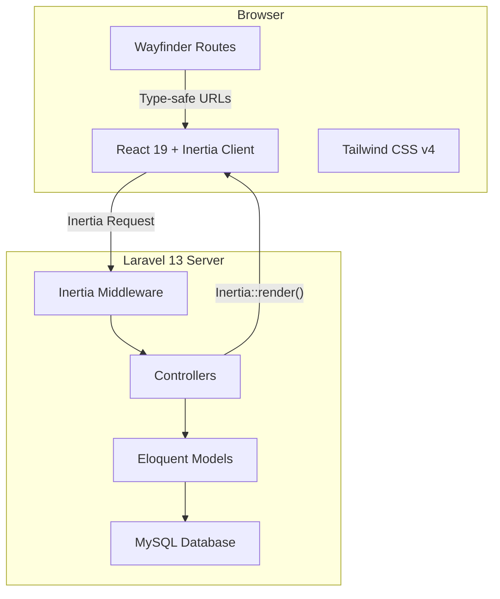
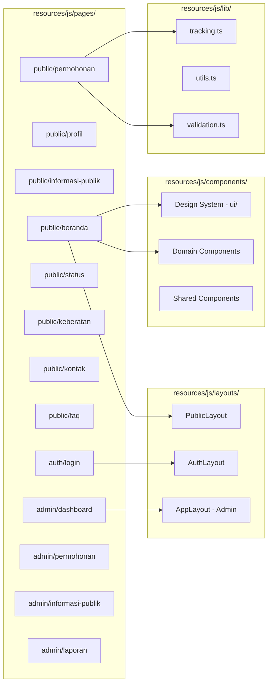
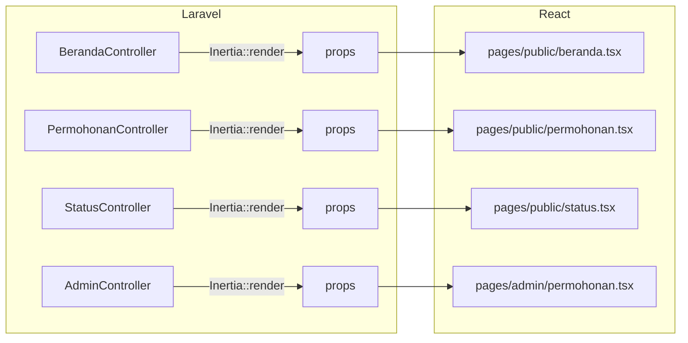
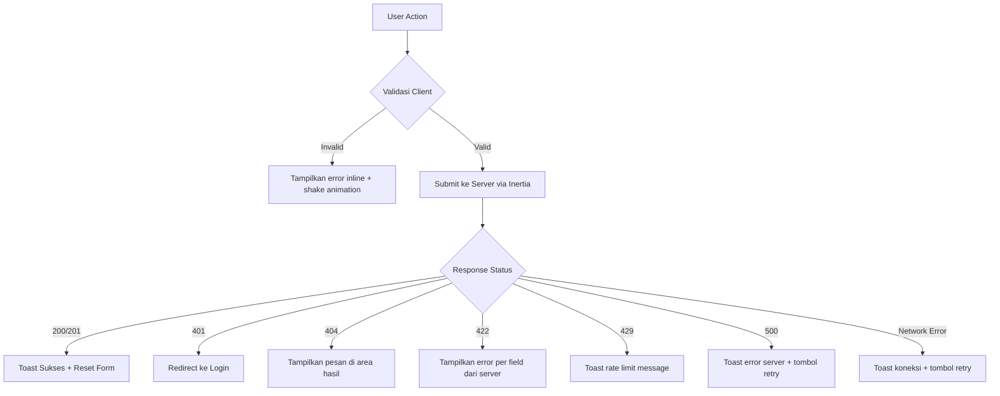

# Design Document: Portal PPID Frontend

## Overview

Dokumen ini mendefinisikan desain teknis frontend Portal PPID Pengadilan Agama Penajam. Frontend dibangun menggunakan stack **Laravel 13 + Inertia.js v3 + React 19 + Tailwind CSS v4**, dengan **Laravel Wayfinder** untuk typed route functions dan **Sonner** untuk toast notifications.

### Tujuan Utama

- Menyediakan portal informasi publik yang responsif, aksesibel, dan performan
- Memfasilitasi permohonan informasi online dan tracking status secara real-time
- Menyediakan dashboard admin untuk manajemen permohonan dan konten
- Memenuhi standar WCAG 2.1 AA dan performa page load ≤ 3 detik pada mobile 3G

### Keputusan Desain Kunci

| Keputusan | Alasan |
|-----------|--------|
| Inertia.js v3 (SPA-like) | Server-side routing tanpa membangun API terpisah, progressive enhancement |
| React 19 + React Compiler | Performa optimal tanpa manual memoization |
| Radix UI + shadcn/ui pattern | Aksesibilitas bawaan, customizable, sudah tersedia di proyek |
| Sonner untuk toast | Sudah terinstall, API sederhana, aksesibel |
| Tailwind CSS v4 + custom theme | Design system konsisten dengan utility-first approach |
| Wayfinder | Type-safe route navigation, auto-generated dari controller Laravel |
| Lucide React | Icon library konsisten, tree-shakeable |

---

## Architecture

### Arsitektur Tingkat Tinggi



### Arsitektur Frontend



### Alur Data (Inertia.js v3)

1. **Server → Client**: Controller memanggil `Inertia::render('public/beranda', $props)` → React component menerima props
2. **Client → Server**: `useForm().submit()` atau `router.visit()` → Laravel controller memproses
3. **Deferred Props**: Data statistik menggunakan `Inertia::defer()` untuk lazy loading
4. **Flash Data**: Pesan sukses/error via flash session → ditampilkan sebagai Toast

---

## Components and Interfaces

### Design System Components (Sudah Ada)

Komponen-komponen berikut sudah tersedia di `resources/js/components/ui/`:

| Komponen | Library | Fungsi |
|----------|---------|--------|
| `Button` | shadcn/ui | Tombol dengan varian primary, secondary, outline, ghost |
| `Card` | shadcn/ui | Container dengan border dan shadow |
| `Input` | shadcn/ui | Field input standar |
| `Label` | Radix UI | Label aksesibel untuk form |
| `Select` | Radix UI | Dropdown select aksesibel |
| `Dialog` | Radix UI | Modal dialog aksesibel |
| `Checkbox` | Radix UI | Checkbox aksesibel |
| `Badge` | shadcn/ui | Badge untuk status |
| `Skeleton` | shadcn/ui | Loading placeholder |
| `Sonner` | sonner | Toast notification system |

### Domain Components (Custom Portal PPID)

| Komponen | Lokasi | Fungsi |
|----------|--------|--------|
| `HeroBanner` | `components/hero-banner.tsx` | Banner utama beranda dengan CTA |
| `StatCard` | `components/stat-card.tsx` | Card statistik dengan ikon |
| `SkeletonCard` | `components/skeleton-card.tsx` | Skeleton loading untuk card |
| `StatusBadge` | `components/status-badge.tsx` | Badge warna sesuai status permohonan |
| `PublicHeader` | `components/public-header.tsx` | Header navigasi publik |
| `PublicFooter` | `components/public-footer.tsx` | Footer portal publik |

### Komponen Baru yang Perlu Dibuat

| Komponen | Lokasi | Fungsi |
|----------|--------|--------|
| `ProgressBar` | `components/progress-bar.tsx` | Indikator langkah form multi-step |
| `FileUpload` | `components/file-upload.tsx` | Upload KTP dengan preview thumbnail |
| `FaqAccordion` | `components/faq-accordion.tsx` | FAQ dengan expand/collapse animasi |
| `TimelineStatus` | `components/timeline-status.tsx` | Timeline riwayat status permohonan |
| `FilterBar` | `components/filter-bar.tsx` | Filter kategori dan tahun informasi publik |
| `DataTable` | `components/data-table.tsx` | Tabel data admin dengan pagination |
| `StatChart` | `components/stat-chart.tsx` | Bar chart statistik permohonan per bulan |
| `ConfirmModal` | `components/confirm-modal.tsx` | Modal konfirmasi aksi destruktif |
| `InputError` | `components/input-error.tsx` | Pesan error form dengan aria-describedby (sudah ada) |
| `SkipToContent` | `components/skip-to-content.tsx` | Link skip-to-content untuk aksesibilitas |

### Layout Structure

```
PublicLayout
├── SkipToContent (tersembunyi, muncul saat fokus)
├── PublicHeader (sticky, hamburger mobile)
├── main#content (konten halaman)
└── PublicFooter

AppLayout (Admin)
├── Sidebar (ungu, menu navigasi admin)
├── Header (breadcrumb, user menu)
└── Content Area
```

### Interface Definitions (TypeScript)

Types sudah didefinisikan di `resources/js/types/ppid.ts`:

```typescript
// Props untuk halaman Inertia (contoh)
interface BerandaPageProps {
    statistik: StatistikDashboard;       // Deferred prop
    informasiTerbaru: InformasiPublik[];
    faq: Faq[];
}

interface PermohonanPageProps {
    // Tidak ada props server, form di-handle client-side
}

interface StatusPageProps {
    result?: StatusCheckResult;          // Hasil pencarian (opsional)
}

interface InformasiPublikPageProps {
    informasi: PaginatedResponse<InformasiPublik>;
    filters: {
        kategori?: KategoriInformasi;
        tahun?: number;
    };
    tahunList: number[];
}

interface AdminPermohonanPageProps {
    permohonan: PaginatedResponse<Permohonan>;
    filters: {
        status?: StatusPermohonan;
    };
}
```

---

## Data Models

### Page Props Flow (Server → Client)



### Form Data Models

| Form | Fields | Validasi Client |
|------|--------|-----------------|
| **Permohonan** | nik, nama_lengkap, alamat, kota, provinsi, no_hp, email, ktp_file, jenis_informasi, nomor_perkara, tujuan, uraian_informasi | NIK 16 digit, email format, HP 10-13 digit, KTP max 2MB jpg/png |
| **Cek Status** | tiket_no | Format PPID-YYYYMMDD-XXXX |
| **Keberatan** | permohonan_tiket, nama_pemohon, alasan | Semua wajib diisi, alasan min 10 karakter |
| **Login Admin** | email, password | Email format, password min 8 karakter |
| **Kelola Informasi** | judul, kategori, sub_kategori, deskripsi, file, tahun, nomor_perkara | Judul wajib, kategori wajib, file PDF max 10MB |

### State Management

Inertia.js v3 mengelola state secara deklaratif melalui page props. Tidak diperlukan state management library tambahan (Redux, Zustand, dll).

| Jenis State | Mekanisme |
|-------------|-----------|
| Server data (daftar permohonan, statistik) | Inertia page props |
| Form state | `useForm()` hook dari `@inertiajs/react` |
| Deferred/lazy data | `Inertia::defer()` + usePage |
| UI state (modal open, tab aktif) | React `useState` lokal |
| Flash messages | Inertia flash → Sonner toast via `use-flash-toast.ts` |
| Navigasi mobile menu | React `useState` lokal |

### Validation Rules (Client-Side)

```typescript
// lib/validation.ts - aturan validasi yang dapat diuji
interface ValidationRule {
    validate: (value: string) => boolean;
    message: string;
}

const rules = {
    nik: {
        validate: (v: string) => /^\d{16}$/.test(v),
        message: 'NIK harus 16 digit angka',
    },
    email: {
        validate: (v: string) => /^[^\s@]+@[^\s@]+\.[^\s@]+$/.test(v),
        message: 'Masukkan alamat email yang benar (contoh: nama@domain.com)',
    },
    noHp: {
        validate: (v: string) => /^\d{10,13}$/.test(v),
        message: 'Nomor HP tidak valid (10-13 digit)',
    },
    namaLengkap: {
        validate: (v: string) => v.trim().length >= 3 && !/^\d+$/.test(v),
        message: 'Nama lengkap tidak valid',
    },
    uraianInformasi: {
        validate: (v: string) => v.trim().length >= 10,
        message: 'Harap berikan uraian yang jelas (minimal 10 karakter)',
    },
    ktpFile: {
        validate: (file: File) => {
            const validTypes = ['image/jpeg', 'image/png'];
            return validTypes.includes(file.type) && file.size <= 2 * 1024 * 1024;
        },
        message: 'File terlalu besar (maks 2MB) atau format salah (hanya jpg/png)',
    },
};
```

---


## Correctness Properties

*A property is a characteristic or behavior that should hold true across all valid executions of a system—essentially, a formal statement about what the system should do. Properties serve as the bridge between human-readable specifications and machine-verifiable correctness guarantees.*

### Property 1: Validasi form menolak input tidak valid dan mengembalikan pesan error yang tepat

*For any* input string dan validation rule yang terdefinisi (NIK, email, no_hp, nama_lengkap, uraian_informasi, ktp_file), jika input tidak memenuhi rule tersebut, maka fungsi `validate()` harus mengembalikan `false` dan pesan error yang sesuai dengan rule tersebut. Selain itu, form submission harus dicegah jika minimal satu field tidak valid.

**Validates: Requirements 6.3, 6.4**

### Property 2: Rendering item informasi publik menampilkan semua field yang diperlukan

*For any* objek `InformasiPublik` yang valid (memiliki judul, kategori, tahun, dan file_url), ketika di-render sebagai list item, output harus mengandung teks judul, label kategori, tahun publikasi, dan tautan unduh file.

**Validates: Requirements 5.3**

### Property 3: Rendering hasil cek status menampilkan semua elemen yang diperlukan

*For any* objek `StatusCheckResult` yang valid (memiliki tiket_no, status, created_at, dan riwayat), ketika di-render, output harus mengandung badge status yang sesuai, tanggal pengajuan, dan timeline riwayat status lengkap.

**Validates: Requirements 7.3**

### Property 4: Rendering baris tabel permohonan admin menampilkan semua kolom

*For any* objek `Permohonan` yang valid, ketika di-render sebagai baris tabel di dashboard admin, output harus mengandung nomor tiket, nama pemohon, jenis informasi, badge status, dan tombol aksi.

**Validates: Requirements 13.1**

### Property 5: Server validation errors (422) ditampilkan pada field yang sesuai

*For any* response 422 dari server yang berisi objek `errors` dengan key berupa nama field dan value berupa array pesan error, setiap pesan error harus ditampilkan di bawah input field yang nama-nya sesuai dengan key di response.

**Validates: Requirements 6.8**

### Property 6: Setiap field form dengan error memiliki aria-describedby yang menunjuk ke pesan error

*For any* input field yang sedang menampilkan pesan error validasi, atribut `aria-describedby` pada input tersebut harus berisi ID yang merujuk ke elemen DOM yang mengandung pesan error untuk field tersebut.

**Validates: Requirements 17.3**

---

## Error Handling

### Strategi Error Handling Per Layer



### Client-Side Validation

| Field | Aturan | Pesan Error |
|-------|--------|-------------|
| NIK | 16 digit angka | "NIK harus 16 digit angka" |
| Nama Lengkap | Min 3 karakter, bukan hanya angka | "Nama lengkap tidak valid" |
| Email | Format email standar | "Masukkan alamat email yang benar (contoh: nama@domain.com)" |
| No. HP | 10-13 digit | "Nomor HP tidak valid" |
| Upload KTP | Max 2MB, jpg/png | "File terlalu besar (maks 2MB) atau format salah" |
| Uraian Informasi | Min 10 karakter | "Harap berikan uraian yang jelas (minimal 10 karakter)" |

### Server Error Handling

| HTTP Status | Behavior Frontend |
|-------------|-------------------|
| 401 Unauthorized | Redirect ke `/login` via Inertia |
| 404 Not Found | Pesan inline "Nomor tiket tidak ditemukan" (bukan toast) |
| 422 Validation | Mapping error per field sesuai response body |
| 429 Rate Limit | Toast error: "Anda telah mencapai batas pengajuan..." |
| 500 Server Error | Toast error: "Terjadi gangguan pada server..." + tombol retry |
| Network Error | Toast error: "Koneksi terputus. Periksa internet Anda." |

### Error Boundary

Gunakan React Error Boundary di level layout untuk menangkap error rendering yang tidak tertangani:

```typescript
// Setiap layout (PublicLayout, AppLayout) dibungkus ErrorBoundary
// Menampilkan fallback UI jika terjadi error rendering
// Log error ke tracking: trackEvent('error', 'render_error', componentName)
```

### Fallback untuk Konten Dinamis

Jika request data gagal (deferred props atau lazy load), tampilkan:
1. Skeleton loading selama request berlangsung
2. Error state dengan tombol "Muat Ulang" jika request gagal
3. Empty state dengan pesan informatif jika data kosong

---

## Testing Strategy

### Pendekatan Testing

Proyek ini menggunakan **Pest v4** untuk PHP testing dan **Vitest** (atau Jest) untuk JavaScript/React testing. Strategi pengujian mengkombinasikan:

1. **Property-Based Tests** — Memvalidasi properti universal yang harus berlaku untuk semua input
2. **Unit Tests** — Memvalidasi behavior spesifik per komponen dan edge case
3. **Feature/Integration Tests** — Memvalidasi flow end-to-end via Pest (server-side)
4. **Browser Tests** — Memvalidasi responsivitas dan interaksi real (Pest + Dusk jika diperlukan)

### Property-Based Testing Configuration

- **Library**: `fast-check` untuk JavaScript property testing
- **Minimum iterations**: 100 per property test
- **Tag format**: `Feature: portal-ppid-frontend, Property {number}: {property_text}`

Setiap correctness property di atas diimplementasikan sebagai satu property-based test:

| Property | Test File | Deskripsi |
|----------|-----------|-----------|
| Property 1 | `tests/js/validation.property.test.ts` | Validasi form rules |
| Property 2 | `tests/js/informasi-publik-item.property.test.ts` | Render item informasi |
| Property 3 | `tests/js/status-check-result.property.test.ts` | Render status check |
| Property 4 | `tests/js/permohonan-table-row.property.test.ts` | Render baris admin |
| Property 5 | `tests/js/server-validation-errors.property.test.ts` | Error mapping 422 |
| Property 6 | `tests/js/form-accessibility.property.test.ts` | aria-describedby |

### Unit Tests (Example-Based)

| Area | Test File | Coverage |
|------|-----------|----------|
| Komponen UI shared | `tests/js/components/` | Button variants, Card, Input states |
| Halaman Beranda | `tests/js/pages/beranda.test.tsx` | Hero, StatCard, Tab, FAQ |
| Form Permohonan | `tests/js/pages/permohonan.test.tsx` | Multi-step, submit, loading |
| Cek Status | `tests/js/pages/status.test.tsx` | Search, result, 404 |
| Dashboard Admin | `tests/js/pages/admin/` | Table, modal, filter |
| Tracking | `tests/js/lib/tracking.test.ts` | trackEvent calls |

### Feature Tests (Pest - Server Side)

| Area | Test File | Coverage |
|------|-----------|----------|
| Permohonan flow | `tests/Feature/PermohonanTest.php` | Submit, validasi, response |
| Status check | `tests/Feature/StatusCheckTest.php` | Found, not found |
| Keberatan | `tests/Feature/KeberatanTest.php` | Submit, validasi |
| Admin dashboard | `tests/Feature/AdminDashboardTest.php` | Auth, CRUD |
| Informasi publik | `tests/Feature/InformasiPublikTest.php` | List, filter, pagination |

### Testing Priorities

1. **P0**: Property tests (validasi, rendering correctness)
2. **P0**: Form permohonan flow (submit, error handling)
3. **P1**: Admin CRUD operations
4. **P1**: Navigasi dan routing
5. **P2**: Aksesibilitas (axe-core audit)
6. **P2**: Responsivitas (visual regression)

