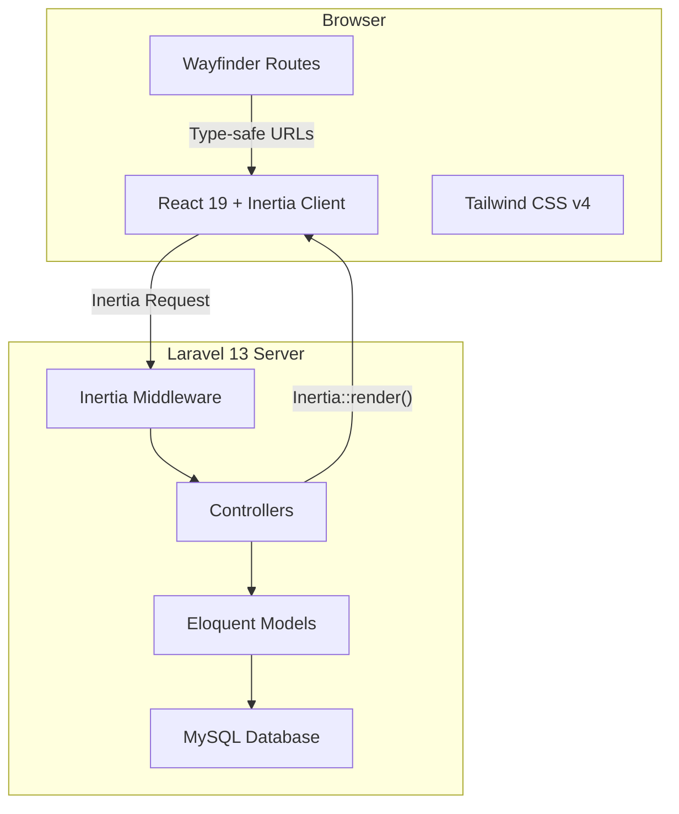
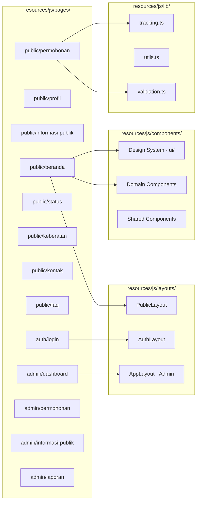
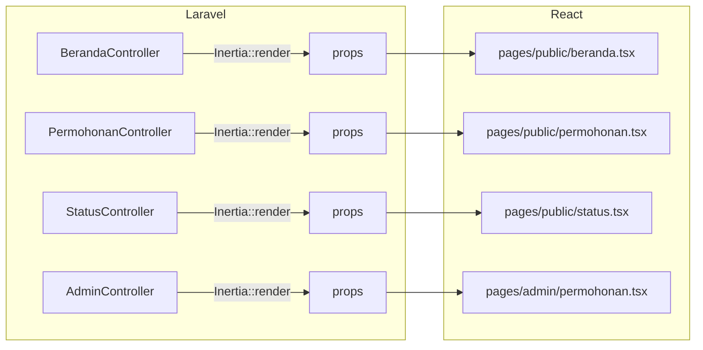

# Design Document: Portal PPID Frontend

## Overview

Dokumen ini mendefinisikan desain teknis frontend Portal PPID Pengadilan Agama Penajam. Frontend dibangun menggunakan stack **Laravel 13 + Inertia.js v3 + React 19 + Tailwind CSS v4**, dengan **Laravel Wayfinder** untuk typed route functions dan **Sonner** untuk toast notifications.

### Tujuan Utama

- Menyediakan portal informasi publik yang responsif, aksesibel, dan performan
- Memfasilitasi permohonan informasi online dan tracking status secara real-time
- Menyediakan dashboard admin untuk manajemen permohonan dan konten
- Memenuhi standar WCAG 2.1 AA dan performa page load ≤ 3 detik pada mobile 3G

### Keputusan Desain Kunci

| Keputusan | Alasan |
|-----------|--------|
| Inertia.js v3 (SPA-like) | Server-side routing tanpa membangun API terpisah, progressive enhancement |
| React 19 + React Compiler | Performa optimal tanpa manual memoization |
| Radix UI + shadcn/ui pattern | Aksesibilitas bawaan, customizable, sudah tersedia di proyek |
| Sonner untuk toast | Sudah terinstall, API sederhana, aksesibel |
| Tailwind CSS v4 + custom theme | Design system konsisten dengan utility-first approach |
| Wayfinder | Type-safe route navigation, auto-generated dari controller Laravel |
| Lucide React | Icon library konsisten, tree-shakeable |

---

## Architecture

### Arsitektur Tingkat Tinggi



### Arsitektur Frontend



### Alur Data (Inertia.js v3)

1. **Server → Client**: Controller memanggil `Inertia::render('public/beranda', $props)` → React component menerima props
2. **Client → Server**: `useForm().submit()` atau `router.visit()` → Laravel controller memproses
3. **Deferred Props**: Data statistik menggunakan `Inertia::defer()` untuk lazy loading
4. **Flash Data**: Pesan sukses/error via flash session → ditampilkan sebagai Toast

---

## Components and Interfaces

### Design System Components (Sudah Ada)

Komponen-komponen berikut sudah tersedia di `resources/js/components/ui/`:

| Komponen | Library | Fungsi |
|----------|---------|--------|
| `Button` | shadcn/ui | Tombol dengan varian primary, secondary, outline, ghost |
| `Card` | shadcn/ui | Container dengan border dan shadow |
| `Input` | shadcn/ui | Field input standar |
| `Label` | Radix UI | Label aksesibel untuk form |
| `Select` | Radix UI | Dropdown select aksesibel |
| `Dialog` | Radix UI | Modal dialog aksesibel |
| `Checkbox` | Radix UI | Checkbox aksesibel |
| `Badge` | shadcn/ui | Badge untuk status |
| `Skeleton` | shadcn/ui | Loading placeholder |
| `Sonner` | sonner | Toast notification system |

### Domain Components (Custom Portal PPID)

| Komponen | Lokasi | Fungsi |
|----------|--------|--------|
| `HeroBanner` | `components/hero-banner.tsx` | Banner utama beranda dengan CTA |
| `StatCard` | `components/stat-card.tsx` | Card statistik dengan ikon |
| `SkeletonCard` | `components/skeleton-card.tsx` | Skeleton loading untuk card |
| `StatusBadge` | `components/status-badge.tsx` | Badge warna sesuai status permohonan |
| `PublicHeader` | `components/public-header.tsx` | Header navigasi publik |
| `PublicFooter` | `components/public-footer.tsx` | Footer portal publik |

### Komponen Baru yang Perlu Dibuat

| Komponen | Lokasi | Fungsi |
|----------|--------|--------|
| `ProgressBar` | `components/progress-bar.tsx` | Indikator langkah form multi-step |
| `FileUpload` | `components/file-upload.tsx` | Upload KTP dengan preview thumbnail |
| `FaqAccordion` | `components/faq-accordion.tsx` | FAQ dengan expand/collapse animasi |
| `TimelineStatus` | `components/timeline-status.tsx` | Timeline riwayat status permohonan |
| `FilterBar` | `components/filter-bar.tsx` | Filter kategori dan tahun informasi publik |
| `DataTable` | `components/data-table.tsx` | Tabel data admin dengan pagination |
| `StatChart` | `components/stat-chart.tsx` | Bar chart statistik permohonan per bulan |
| `ConfirmModal` | `components/confirm-modal.tsx` | Modal konfirmasi aksi destruktif |
| `InputError` | `components/input-error.tsx` | Pesan error form dengan aria-describedby (sudah ada) |
| `SkipToContent` | `components/skip-to-content.tsx` | Link skip-to-content untuk aksesibilitas |

### Layout Structure

```
PublicLayout
├── SkipToContent (tersembunyi, muncul saat fokus)
├── PublicHeader (sticky, hamburger mobile)
├── main#content (konten halaman)
└── PublicFooter

AppLayout (Admin)
├── Sidebar (ungu, menu navigasi admin)
├── Header (breadcrumb, user menu)
└── Content Area
```

### Interface Definitions (TypeScript)

Types sudah didefinisikan di `resources/js/types/ppid.ts`:

```typescript
// Props untuk halaman Inertia (contoh)
interface BerandaPageProps {
    statistik: StatistikDashboard;       // Deferred prop
    informasiTerbaru: InformasiPublik[];
    faq: Faq[];
}

interface PermohonanPageProps {
    // Tidak ada props server, form di-handle client-side
}

interface StatusPageProps {
    result?: StatusCheckResult;          // Hasil pencarian (opsional)
}

interface InformasiPublikPageProps {
    informasi: PaginatedResponse<InformasiPublik>;
    filters: {
        kategori?: KategoriInformasi;
        tahun?: number;
    };
    tahunList: number[];
}

interface AdminPermohonanPageProps {
    permohonan: PaginatedResponse<Permohonan>;
    filters: {
        status?: StatusPermohonan;
    };
}
```

---

## Data Models

### Page Props Flow (Server → Client)



### Form Data Models

| Form | Fields | Validasi Client |
|------|--------|-----------------|
| **Permohonan** | nik, nama_lengkap, alamat, kota, provinsi, no_hp, email, ktp_file, jenis_informasi, nomor_perkara, tujuan, uraian_informasi | NIK 16 digit, email format, HP 10-13 digit, KTP max 2MB jpg/png |
| **Cek Status** | tiket_no | Format PPID-YYYYMMDD-XXXX |
| **Keberatan** | permohonan_tiket, nama_pemohon, alasan | Semua wajib diisi, alasan min 10 karakter |
| **Login Admin** | email, password | Email format, password min 8 karakter |
| **Kelola Informasi** | judul, kategori, sub_kategori, deskripsi, file, tahun, nomor_perkara | Judul wajib, kategori wajib, file PDF max 10MB |

### State Management

Inertia.js v3 mengelola state secara deklaratif melalui page props. Tidak diperlukan state management library tambahan (Redux, Zustand, dll).

| Jenis State | Mekanisme |
|-------------|-----------|
| Server data (daftar permohonan, statistik) | Inertia page props |
| Form state | `useForm()` hook dari `@inertiajs/react` |
| Deferred/lazy data | `Inertia::defer()` + usePage |
| UI state (modal open, tab aktif) | React `useState` lokal |
| Flash messages | Inertia flash → Sonner toast via `use-flash-toast.ts` |
| Navigasi mobile menu | React `useState` lokal |

### Validation Rules (Client-Side)

```typescript
// lib/validation.ts - aturan validasi yang dapat diuji
interface ValidationRule {
    validate: (value: string) => boolean;
    message: string;
}

const rules = {
    nik: {
        validate: (v: string) => /^\d{16}$/.test(v),
        message: 'NIK harus 16 digit angka',
    },
    email: {
        validate: (v: string) => /^[^\s@]+@[^\s@]+\.[^\s@]+$/.test(v),
        message: 'Masukkan alamat email yang benar (contoh: nama@domain.com)',
    },
    noHp: {
        validate: (v: string) => /^\d{10,13}$/.test(v),
        message: 'Nomor HP tidak valid (10-13 digit)',
    },
    namaLengkap: {
        validate: (v: string) => v.trim().length >= 3 && !/^\d+$/.test(v),
        message: 'Nama lengkap tidak valid',
    },
    uraianInformasi: {
        validate: (v: string) => v.trim().length >= 10,
        message: 'Harap berikan uraian yang jelas (minimal 10 karakter)',
    },
    ktpFile: {
        validate: (file: File) => {
            const validTypes = ['image/jpeg', 'image/png'];
            return validTypes.includes(file.type) && file.size <= 2 * 1024 * 1024;
        },
        message: 'File terlalu besar (maks 2MB) atau format salah (hanya jpg/png)',
    },
};
```

---

